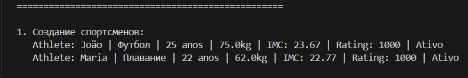
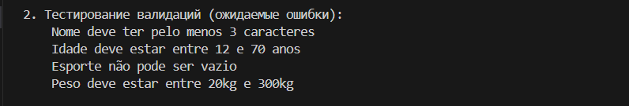
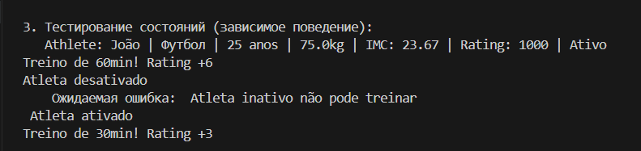
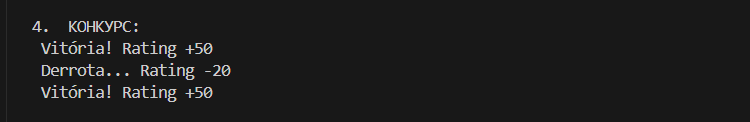
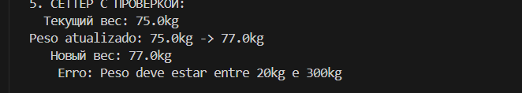
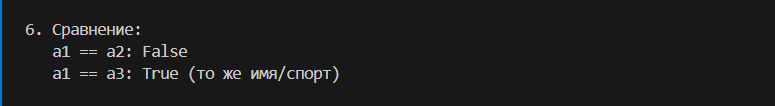
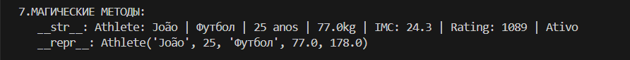
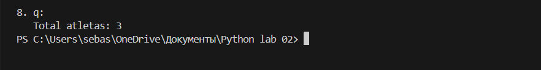

## Oбъектно-Oриентированное Программирование 
##  ЛР-1 — Класс и инкапсуляция (Python 3.x)
## 7. Фитнес / Спорт
## Цель работы
* Освоить объявление пользовательских классов.
* Разобраться с инкапсуляцией (атрибуты экземпляра, закрытые поля).
* Реализовать свойства (@property).
* Переопределить магические методы (`__str__`, `__repr__`, `__eq__`).
* Осознать разницу между атрибутами класса и экземпляра.

## Студент: Домингуш Себастиау Леандру Жоау
## Уровень: 5 (Полный)

## O Проекте

В этом проекте реализована упрощенная система управления спортсменами для демонстрации фундаментальных конце объектно-ориентированного программирования (ООП) на Python с упором на:

- **Инкапсуляция**: защита данных с использованием частных атрибутов
- **Свойства**: контролируемый доступ через геттеры и сеттеры
- **Проверка данных**: гарантия целостности объектов
- **Состояния объекта**: поведение, зависящее от внутреннего состояния
- **Магические методы**: настройка поведения Python по умолчанию

Основной класс **"Athlete"** (спортсмен) представляет спортсмена с такими атрибутами, как имя, возраст, вид спорта, вес, рост и рейтинг, а также методы обучения, соревнований и управления своим состоянием.

Класс содержит один атрибут класса и семь атрибутов экземпляра.

## Атрибут класса:
**total_athletes:** Говорит, сколько спортсменов было создано
## Атрибут экземпляра
- **_name:** Имя спортсмена
- **_age:** возраст спортсмена
- **_sport:** тип разгильдяйства
- **_weight:** вес спортсмена
- **_height:** рост спортсмена
- **_rating:** представляет выступление спортсмена
- **_active:** указывает, активен ли спортсмен или неактивен в системе.

## Propriedades (@ property)
- **name** - возвращает имя спортсмена - только для чтения
- **age** - возвращает возраст спортсмена - только для чтения
- **sport** - возвращает тип спорта, которым занимается спортсмен - только для чтения
- **weight** - обновление и / или возвращает текущий вес спортсмена-чтение и запись
- **height** - возвращает текущую высоту спортсмена - только для чтения
- **rating** - представляет выступление спортсмена - только для чтения
- **active** - возвращает состояние спортсмена (включено/выключено) - только для чтения 
- **imc** - возвращает индекс массы тела спортсмена - только для чтения

## Метод торговли:
- **treinar:** Запись тренировки
- **competir:** Регистрирует конкурс

## Методы состояния:
- **ativar:** Активирует спортсмена
- **desativar:** Отключает спортсмена

## МАГИЧЕСКИЕ МЕТОДЫ:
- `__str__` — Удобное представление информации спортсмена, читаемое для пользователя
- `__repr__` — техническое представление спортсмена - для разработчика
- `__eq__` — сравнение спортсменов по названию и виду спорта

- проверка имени (спортсмен)

- подтверждение возраста (спортсмен)

 

- Проверка спорта (спорт, которым занимается спортсмен)

-   Проверка веса (спортсмена, )

- Проверка роста (спортсмен)

- Проверка рейтинга(это число?Разве это не отрицательно?, рейтинг никогда не может быть отрицательным)

 - она записывает тренировку

- она говорит, активен ли спортсмен или неактивен

