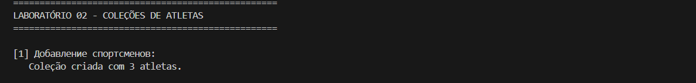
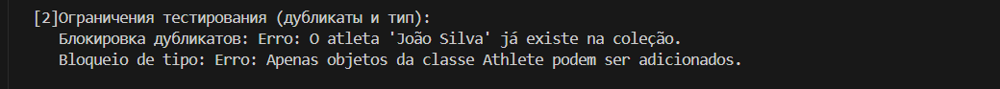
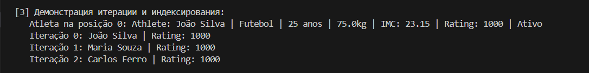
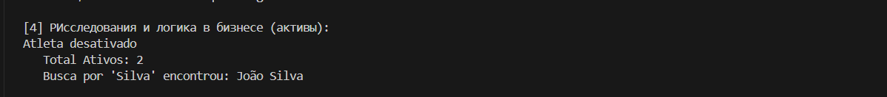
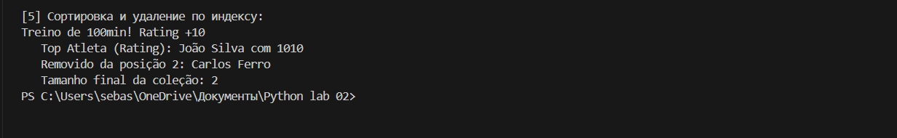

## ЛР-2 — Коллекция объектов (Python 3.x)

## 7. Фитнес / Спорт — Управление спортсменами

## Студент: Домингуш Себастиау Леандру Жоау
## Число: 5 (Завершение уровня / Задание на 5)

## Цель практического занятия
* Основное внимание в этом лабораторном занятии уделяется реализации контейнера (класса коллекции) для      управления объектами Athlete, созданными в LP-1. 
* Проект исследует манипуляции со списками, магические методы контейнера и бизнес-логику, применяемую к группам объектов.

## Прикладные концепции:
* Абстракция коллекции: Студент -> Коллекция студентов / Спортсмен -> Коллекция спортсменов.
* Управление данными: Методы для добавления, удаления и доступа к элементам.
* Протоколы Python (магические методы): Реализация итерации и индексации.
* Целостность данных: Проверка типов и блокировка дубликатов.
* Логика фильтрации и сортировки: Обработка списков на основе атрибутов.

## Структура проекта
* Управление коллекцией осуществляется классом AthleteCollection, который выступает в качестве централизованного хранилища данных об спортсменах.

## Атрибуты коллекции
* _items_: Приватный(_list_) , хранящий экземпляры класса(_Athlete_).
 ## Реализованные функции (уровни 5)
* Расширенный доступ и фильтры
* _Index_: __getitem__ позволяет получить прямой доступ по индексу (например, collection[0]).
* Удаление по должности: _remove_at(index)_ для удаления элементов по индексу
* Заказ: _sort_by_rating()_ Расположите спортсменов в порядке убывания рейтинга.
* Государственные фильтры:_get_active()_ Возвращает подсписок, содержащий только спортсменов, активно участвующих в системе.

## Демонстрация (demo.py)
* Добавление спортсменов:Добавление нескольких спортсменов и блокировка недопустимых типов.

* Ограничения тестирования:Неудачная попытка добавить одного и того же спортсмена дважды.

* Демонстрация итерации и индексирования: Для отображения данных используются индексы и итерация.

* PИсследования и логика в бизнесе (активы):Фильтрация активных спортсменов и сортировка по результатам (рейтингу).

* Сортировка и удаление по индексу.

