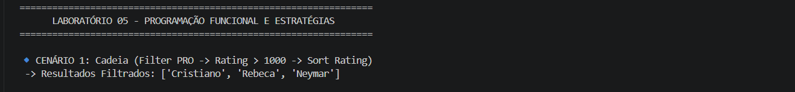
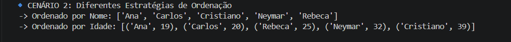
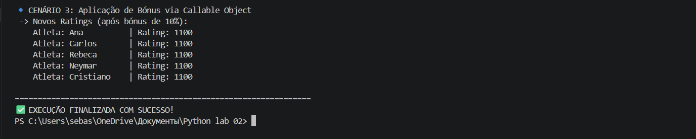

## ЛР-5 — Функции как аргументы. Стратегии и делегаты.
## Студент: Домингуш Себастиау Леандру Жоау
##   7. Фитнес / Спорт —  Гибкое управление коллекцией
## Число: 5 (Завершение уровня / Задание на 5)

## 1. Цель работы

__Освоить передачу функций как аргументов в другие функции и методы, превращая их в "объекты первого класса"

__Научиться применять встроенные функции высшего порядка: `map`, `filter` e `sorted` для эффективной обработки данных

__Понять концепцию паттерна «Стратегия» и реализовать его на Python через функции и callable-объекты

__Освоить lambda-выражения и их практическое применение в задачах фильтрации и сортировки

__Интегрировать функциональный стиль с объектно-ориентированным кодом из предыдущих ЛР (ЛР-1, ЛР-2, ЛР-3).
  
## 2. Реализованные функции и стратегии
**Функции-стратегии** `(Strategies)`
**Реализовано в файле** `strategies.py:`

**Сортировка:** `sort_by_name`, `sort_by_rating` и комплексная стратегия
`sort_by_age_and_weight`.

**Фильтрация:** `is_professional` и фабрика функций
`make_rating_filter(min_rating)`  который использует замыкания для создания динамических фильтров.

**Паттерн «Стратегия»** `(Callable Objects)`
`TrainingBonusStrategy`  Класс, реализующий данный метод `__call__`. Это позволяет вызывать объект как функцию, сохраняя при этом внутреннее состояние (множитель бонуса).

## 3. Реализация в коллекции 
Класс `AthleteCollection`  Он был расширен для поддержки Fluent Interface (Chaining):
`sort_by(key_func)` Получает стратегию сортировки.
`filter_by(predicate)`: Она принимает функцию фильтрации и возвращает новую отфильтрованную коллекцию.
`apply(func)`: Применяет преобразование или действие ко всем элементам коллекции, используя стратегическую логику.

## 4. Демонстрация работы (Сценарии)
**Сценарий 1: Цепочка операций (Pipeline)**
**Демонстрирует** последовательное использование `filter_by -> sort_by` и извлечение данных с помощью `map()`.
 

**Сценарий 2: Замена стратегии**
Это **демонстрирует**, как коллекция меняет свое поведение при сортировке, просто изменяя функцию, передаваемую в качестве аргумента (имя против возраста через лямбда-функцию).

**Сценарий 3: Callable-объект**
**Демонстрирует** применение 10%-ного бонуса к рейтингу всех спортсменов, использующих данную стратегию.`TrainingBonusStrategy`.
