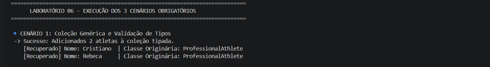
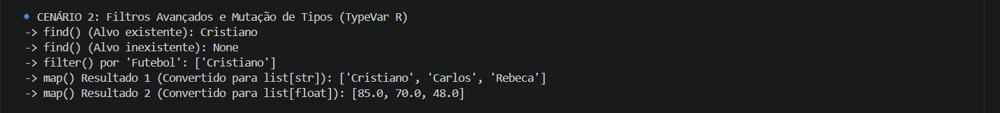
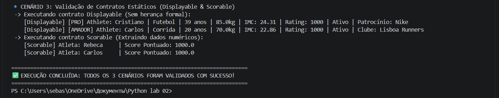

## ЛР-6 — Generics и typing
## Студент: Домингуш Себастиау Леандру Жоау
##   7. Фитнес / Спорт —  Гибкое управление коллекцией
## Число: 5 (Завершение уровня / Задание на 5)

## ## Цели проекта
* **Системы аннотирования типов:** Освоить статическую экосистему Python с помощью встроенного модуля `typing`.

* **Обобщенные объектно-ориентированные классы (обобщения):** Создавать многократно используемые и параметризуемые классы и коллекции с помощью инструментов `TypeVar` и `Generic`.

* **Структурная типизация (статическая утиная типизация):** Понимать и применять гибкие поведенческие контракты, отделенные от классического наследования, с помощью `typing.Protocol`.

 ## Технологии и прикладные концепции

### 1. Жесткая аннотация типов (Уровень 3)
Модель данных, унаследованная от класса `Athlete`, была усилена в сигнатуре его конструкторов, бизнес-методов и свойств:
* Обеспечивает раннее обнаружение ошибок во время разработки.

* Встроенная документация контрактов ввода и вывода приложения.

## 2. Множественные обобщенные коллекции (Уровень 4)
Класс `TypedCollection(Generic[T])` был создан в файле `container.py` для абстрагирования безопасного хранения:
* **Метод `find`:** Принимает предикат `Callable[[T], bool]` и возвращает `Optional[T]`.

* **Метод `filter`:** Выполняет встроенную фильтрацию, возвращая тип, строго сопоставленный с `list[T]`.

* **Метод `map`:** Реализует преобразования данных на основе второго независимого обобщенного идентификатора (`TypeVar('R')`), позволяя сопоставлять коллекции объектов с примитивными списками (`list[str]` или `list[float]`), сохраняя при этом видимость типов в интерпретаторе.

### 3. Protocolos Limitados / Subtipagem Estrutural (Nível 5)
Implementação de polimorfismo estrutural puro sem acoplamento de herança (`class Classe(Interface)`):
*   **`Displayable` (Protocol):** Exige a presença e assinatura do método `.display() -> str`.
*   **`Scorable` (Protocol):** Exige a presença e assinatura do método `.score() -> float`.
*   Utilização de *Bounded TypeVars* (`D = TypeVar('D', bound=Displayable)`) garantindo que o contentor genérico limite o acesso apenas a objetos que cumprem o respetivo contrato em tempo de compilação/checagem estática.

##  Структура демонстрации
Файл `demo.py` проверяет и изолирует соответствие требованиям в **3 различных сценариях**:

1. **Сценарий 1 (Примечание 3):** Создание, хранение и проверка базовых структурированных типов в рамках `TypedCollection`.

2. **Сценарий 2 (Примечание 4):** Выполнение логики функционального поиска (`find`), изоляции критериев (`filter`) и проверки изменения типов с помощью `map`.

3. **Сценарий 3 (Примечание 5):** Перекрестная проверка взаимодействия нескольких гибридных типов иерархии в рамках протоколов отображения и метрики, подтверждающая функциональность статической типизации Duck Typing.

